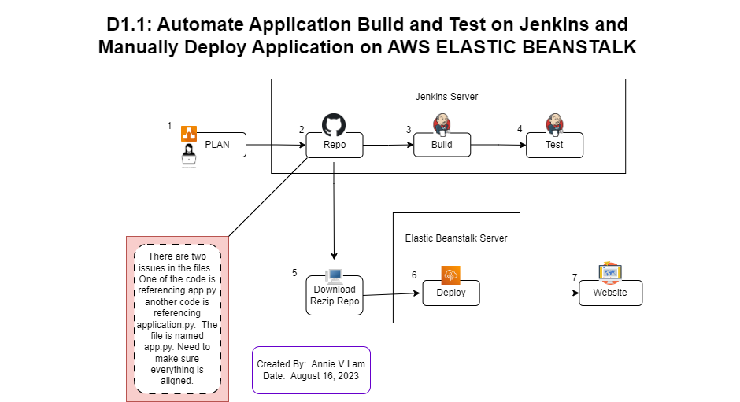

# Manually Deploy a Flask Application to Elastic Beanstalk

By:  Annie V Lam - Kura Labs

August 16, 2023


## Step #1 Plan Deployment




## Step #2 Upload Repository to GitHub

Upload the repository to GitHub and generate a [GitHub token](https://github.com/LamAnnieV/GitHub/blob/main/Generate_GitHub_Token.md)


## Step #3 and Step #4:  Use Jenkins to Auto Build and Auto Test Application

Log into Jenkins create a build for the application from GitHub Repository https://github.com/LamAnnieV/Deployment_01.1.git and run the build

### Results


## Step #5:  Download Repository from GitHub

Download Repository, Unzip files, and re-zip files


## Step #6:  Deploy Application on AWS ELASTIC BEANSTALK

**Create AWS IAM roles to manually deploy the application on Elastic Beanstalk**

How to set up [IAM Role](https://github.com/LamAnnieV/Setup_AWS/blob/main/Create_AWS_IAM_Roles.md).  

**Deploy application on Elastic Beanstalk**

How to deploy the application to Elastic Beanstalk, click [here](https://github.com/LamAnnieV/AWS_Services/blob/main/elastic_beanstalk.md).

**1st Attempt: Health Status:  Degraded**


## Step #8: Debugging

```
1. Downloaded 1st 100 lines of the log
2. Searched for "Error" in the log and it is contained in the "/var/log/web.stdout.log" section
3. Copied "/var/log/web.stdout.log" section to ChatGPT to Explain AWS Log:
4. Per ChatGPT, the main issue is ModuleNotFoundError: No module named 'application...Make sure the application module is correctly named"
5. *Renamed the app.py to application.py, rezip content
6. Reload Files and Re-Deployed Applications on AWS Elastic Beanstalk
```

**2nd Attempt: Health Status:  OK**

**Notes for Step #8, item #5**

-  This change should also be made in the GitHub repository.  If this change is made in the repository, this will cause an issue in the Test Stage of the Jenkins Build.  Since the Test Stage imports an object called app from module app.py that module app.py can no longer be found. In order to resolve this, the code in test_app.py needs to be updated from 'from app import app' to 'from application import app'.  When there are any changes, we need to keep in mind if that change will affect other areas in the pipeline.

            
## Step #8:  Launch Website

http://url-shortener-env.eba-av38k5ye.us-east-1.elasticbeanstalk.com/


